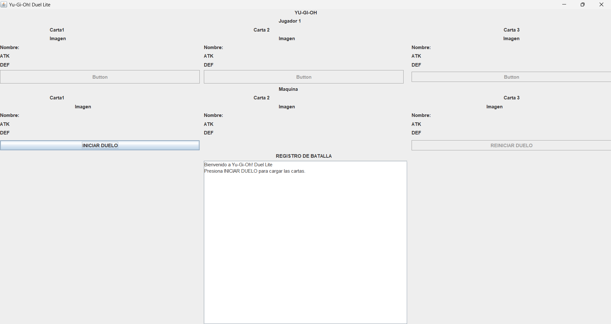
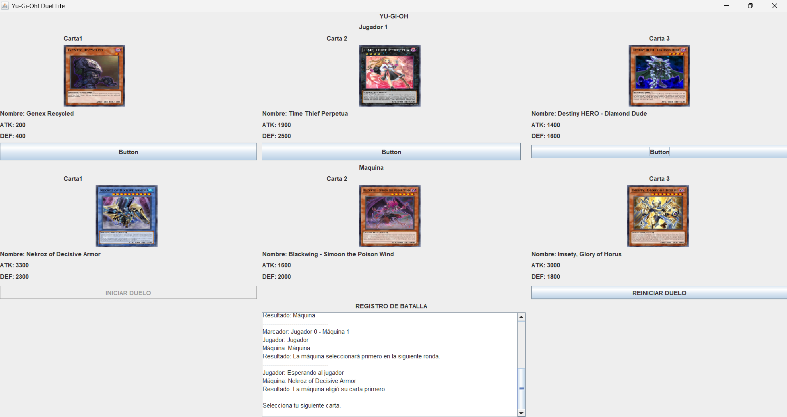
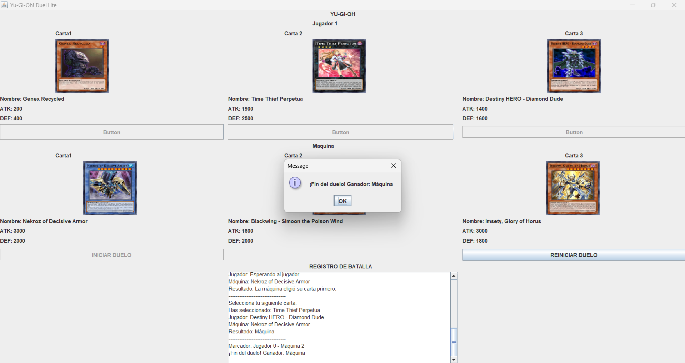

# Yu-Gi-Oh

Juego de cartas sencillo desarrollado en Java. Permite jugar un duelo contra la máquina usando cartas obtenidas de la API de YGOPRODeck.

## Requisitos

- Java JDK 11 o superior.
- Conexión a Internet.
- IntelliJ IDEA.
- La biblioteca `json-20230227.jar` incluida en la carpeta `lib`.

## Ejecución

1. Abre la carpeta del proyecto en IntelliJ IDEA.
2. Configura el JDK del proyecto.
3. Verifica que `lib/json-20230227.jar` esté agregado a las bibliotecas del proyecto.
4. Abre `src/YgoDuelGui.java`.
5. Ejecuta el método `main`.

Para jugar, pulsa el boton de iniciar duelo y selecciona una carta en cada ronda. La máquina elegirá una carta automáticamente y gana la ronda la carta con mayor ATK; si empatan, se comparan los puntos DEF. Cada vez que se elige una carta el marcador se actualiza e indica el resultado de la partida.

## Diseño

El proyecto separa la interfaz gráfica de la lógica del duelo y del acceso a la API.

- `YgoDuelGui`: muestra las cartas y los controles, y comunica las acciones del jugador con la lógica del juego.
- `Duel`: controla las rondas, las cartas elegidas y el marcador.
- `Card`: representa una carta con su nombre, ATK, DEF e imagen.
- `BattleListener`: permite comunicar a la interfaz los cambios y resultados del duelo.
- `YgoApiClient`: consulta la API de YGOPRODeck y obtiene los datos de las cartas.
- `Main`: archivo de ejemplo; para iniciar el juego se utiliza `YgoDuelGui`.

## API utilizada

El programa obtiene cartas desde la API de YGOPRODeck:

https://db.ygoprodeck.com/api/v7/randomcard.php

Se requiere conexión a Internet para cargar las cartas y sus imágenes.

